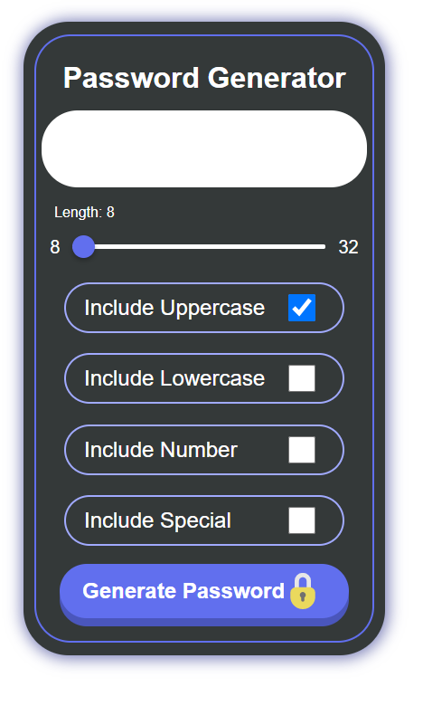

# Password Generator

Passwords are important, and abc123 isn't going to get you far. A password generator can remove the cognitive friction of trying to come up with a strong combination of characters that will protect your account.

Nowadays, password generators tend to be built into browsers, however the code behind them will likely be quite similar to what I present here, and hence the learning process is still relevant.

## The process

You need to store a bunch of characters. I used arrays to hold the unicodes of the characters I want, and converted them into strings with `String.fromCharCode()`, however looking back I think using strings would have been the better, easier choice. If I wanted to, however, I could add a feature whereby the user inputs two numbers and a function adds the unicode characters between these numbers as a checkox option.

Each array (or string) holds a type of character you want (uppercase, lowercase, numeric, special/symbols). 

A random number is then generated from zero to the length of the combined array minus one, and is used as the index to select an individual character. This is repeated for as many iterations as specificed by the user when they change the length slider.

One inherant issue with this process is that, the more characters there are of a type, the more likely they are to be selected at random. Numbers, for example, have the least likelihood. My way around this was to first pick what type of character is chosen. A number between 0 and 3 (depending on how many checkboxes are ticked) is generated and this selects the type of character to be generated.

## The finished product

[Link to site](https://bytemybits.github.io/password-generator/)